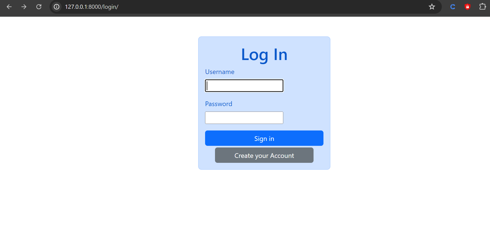
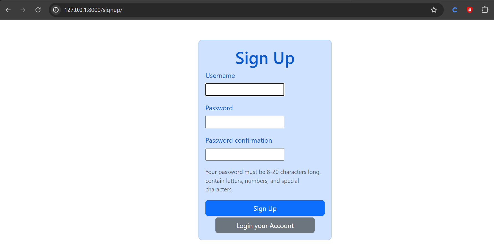
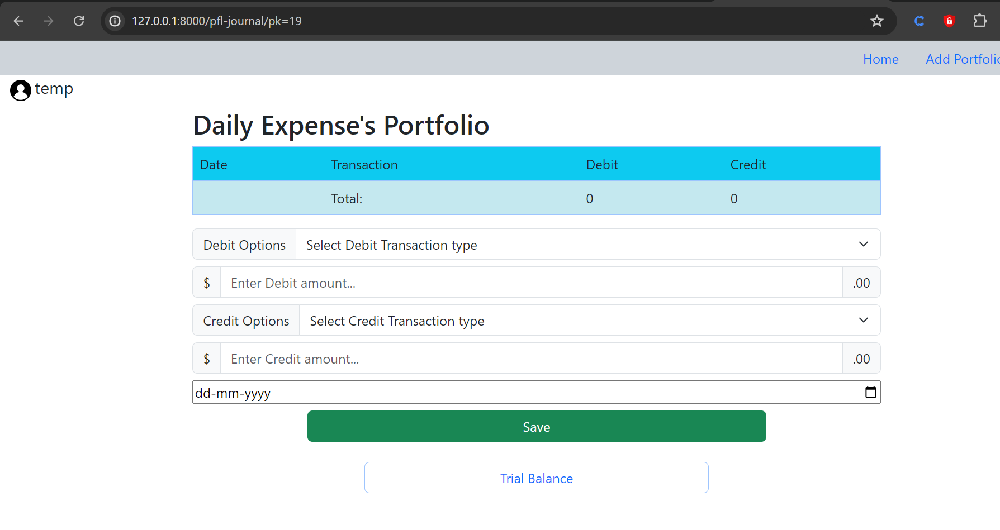
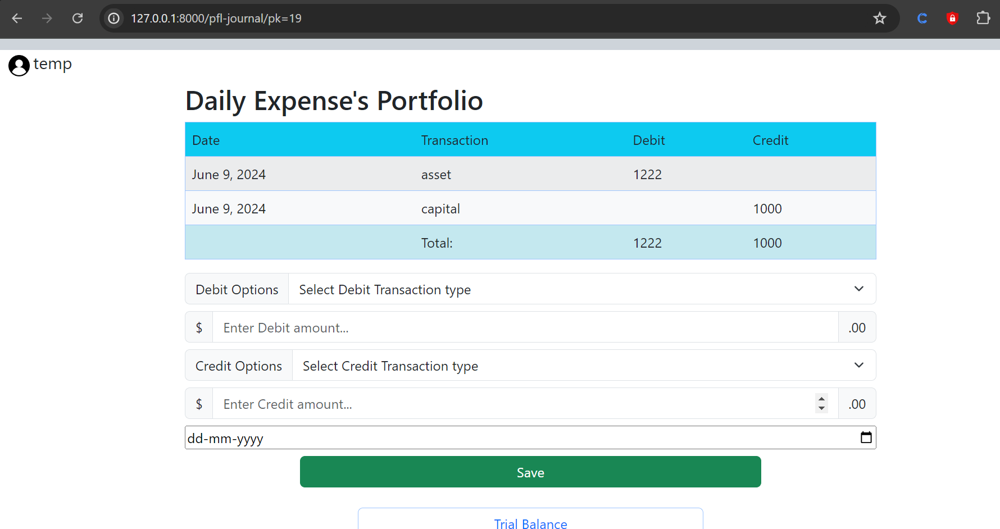
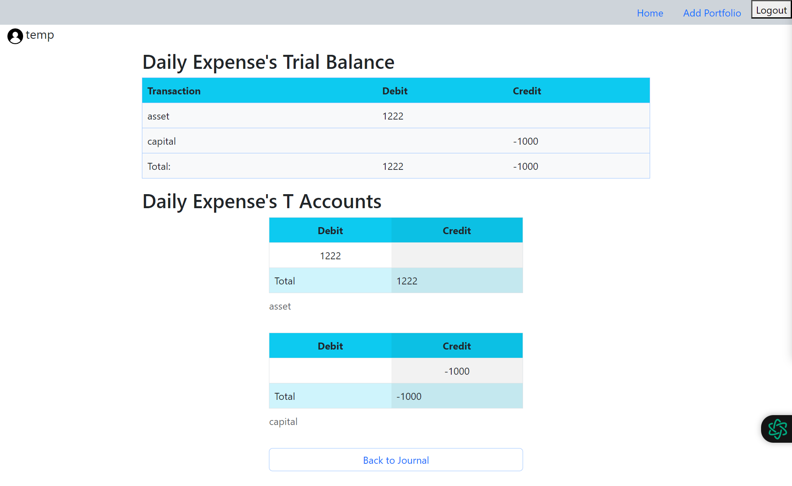
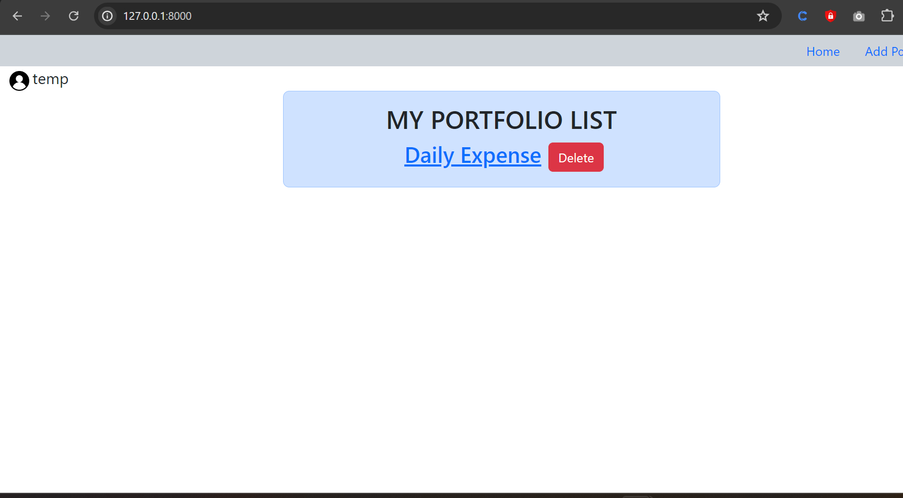

# Account App

This is a Account App for daily Expense manegement Developed using **DJANGO** .The following Submodule created:

- Sign In
- Login
- Log Out
- Add Expense
- Delete Expense
- List Expense

## Prerequisites

- Python (version 3.x)
- pip (Python package installer)
- Virtualenv (optional, but recommended)

## Installation

### 1. Clone the Repository

```sh
git clone https://github.com/yourusername/yourproject.git
cd yourproject
```

### 2. Create and Activate Virtual Environment

On macOS/Linux
```sh
python3 -m venv venv
source venv/bin/activate
```
On Windows
```sh
python -m venv venv
venv\Scripts\activate
```
### 3. Install Dependencies
```sh
pip install -r requirements.txt
```
### 4. Run the Development Server
```sh
python manage.py runserver
```

### 5. Access the Project

http://127.0.0.1:8000/


You should see your Django project running. You can access the admin interface at:

http://127.0.0.1:8000/admin/

### Login Page


### Signup Page


### Home Page


### Add Expense Page


### List Expenses Page


### Delete Expenses

